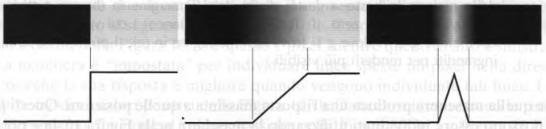
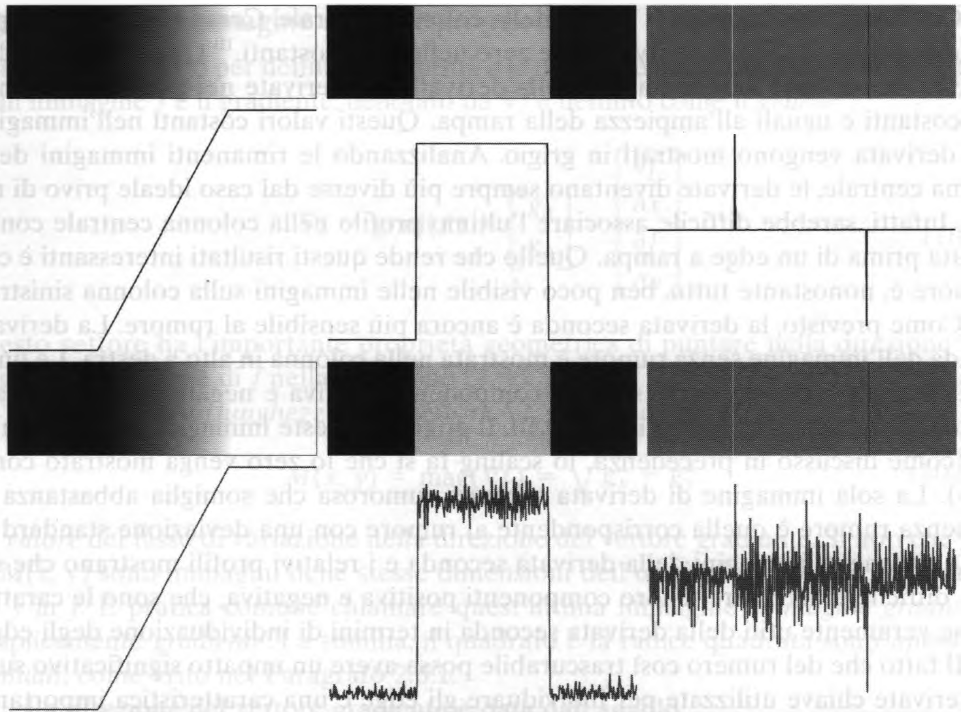
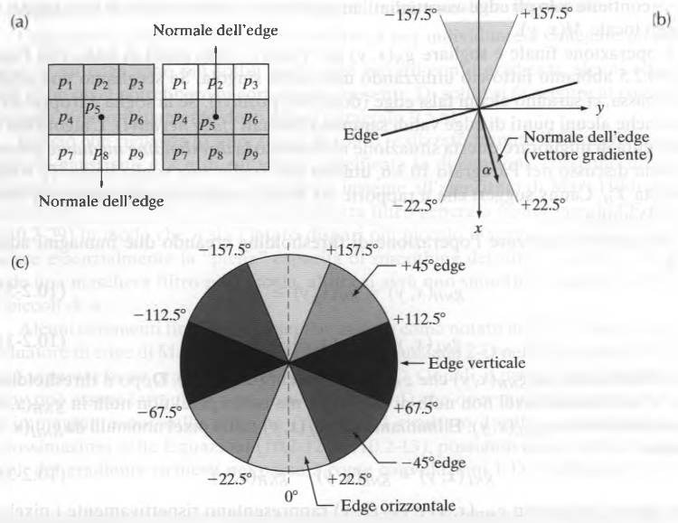
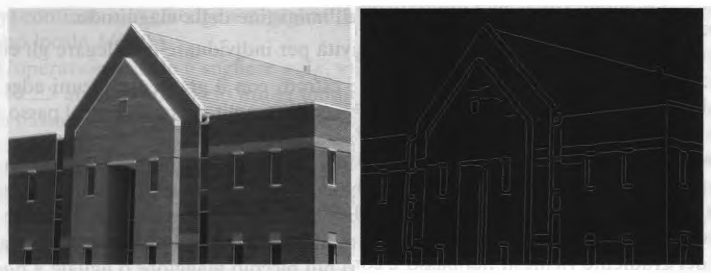

# Algoritmo di Canny

## Definizione

L'algoritmo di Canny rientra nella categoria degli algoritmi di segmentazione delle immagini, con l'obiettivo di individuare gli edge.

Un edge costituisce il risultato ottenuto dalla rilevazione di una variazione d'intensità all'interno di un'immagine.

Un edge *ideale* implica una transizione tra due livelli di intensità che avviene idealmente alla distanza di 1 pixel.
Nelle applicazioni pratiche, le immagini hanno edge che sono sfocati e rumorosi, con una sfocatura determinata principalmente dalla messa a fuoco del dispositivo di acquisizione e con un livello di rumore dipendente da componenti elettroniche e di codifica delle informazioni.

Il processo di individuazione degli edge è il metodo utilizzato più frequentemente per segmentare immagini basate su bruschi (locali) cambiamenti di intensità.


> Da sinistra a destra, modelli ideali di edge a gradino, a rampa e roof, con i loro profili di intensità corrispondenti.

## Algoritmo

### 1. Applicazione filtro gaussiano

Dal momento che la rilevazione degli edge è suscettibile al rumore, conviene innanzitutto rimuoverlo applicando un filtro di smoothing gaussiano con un kernel almeno di dimensioni 5x5.

```c++
Mat gauss;
GaussianBlur(src, gauss, Size(5, 5), 0, 0);
```

### 2. Calcolo del gradiente delle variazioni d'intensità

L'immagine corretta dal passo precedente viene filtrata attraverso un kernel di Sobel sia in direzione orizzontale che verticale.

```c++
Mat dx, dy;
Sobel(gauss, dx, CV_32F, 1, 0);
Sobel(gauss, dy, CV_32F, 0, 1);
```

Da queste due immagini ottenute si può trovare quindi il gradiente degli edge con le sue direzioni per ogni pixel calcolando prima le derivate al quadrato delle due immagini, per poi calcolarlo effettivamente.

&space;=&space;\sqrt{g^2_x&space;&plus;&space;g^2_y})

```c++
Mat dx2, dy2, mag;
pow(dx, 2, dx2);
pow(dy, 2, dy2);

sqrt(dx2 + dy2, mag);

normalize(mag, mag, 0, 255, NORM_MINMAX, CV_8U);
```

### 3. Soppressione dei punti non di massimo



Siccome l'immagine ottenuta al passo precedente è stata calcolata mediante il gradiente, essa contiene ampie “creste” attorno ai massimi locali. Per assottigliare tali creste e avvicinare il risultato ad un caso ideale si ricorre alla tecnica del *non maxima suppression*.

Si considera un numero finito di orientamenti in una regione 3x3: si ottengono 4 orientamenti:

- orizzontale
- verticale
- +45°
- -45°



Per il calcolo è necessario ottenere una matrice degli angoli di rotazione, ottenibile mediante la seguente formula.


```c++
// genera matrice degli angoli di rotazione 
Mat orient;
phase(dx, dy, orient);
```

Per ogni orientamento si hanno due distinti intervalli di appartenenza, che è possibile ottenere mediante opportuni controlli.

```c++
// genera matrice degli angoli di rotazione 
Mat orient;
phase(dx, dy, orient);

Mat nms = Mat::zeros(mag.size(), CV_8U);

for (int i = 0; i < mag.rows; i++)
	for (int j = 0; j < mag.cols; j++) {
		float angle = orient.at<float>(i, j);

		// orizzontale
		if (angle < 22.5 && angle > -22.5 || angle < -157.5 && angle > 157.5) {
			if (mag.at<uchar>(i, j) > mag.at<uchar>(i, j - 1) && mag.at<uchar>(i, j) > mag.at<uchar>(i, j + 1))
				nms.at<uchar>(i, j) = mag.at<uchar>(i, j);
		}
		// verticale
		else if (angle < 112.5 && angle > 67.5 || angle < -67.5 && angle > -112.5) {
			if (mag.at<uchar>(i, j) > mag.at<uchar>(i - 1, j) && mag.at<uchar>(i, j) > mag.at<uchar>(i + 1, j)) 
				nms.at<uchar>(i, j) = mag.at<uchar>(i, j);
		}
		// diagonale sx
		else if (angle < -112.5 && angle > -157.5 || angle < 67.5 && angle > 22.5) {
			if (mag.at<uchar>(i, j) > mag.at<uchar>(i - 1, j - 1) && mag.at<uchar>(i, j) > mag.at<uchar>(i + 1, j + 1))
				nms.at<uchar>(i, j) = mag.at<uchar>(i, j);
		}
		// diagonale dx
		else if (angle < 157.5 && angle > 112.5 || angle < -22.5 && angle > -67.5) {
			if (mag.at<uchar>(i, j) > mag.at<uchar>(i - 1, j + 1) && mag.at<uchar>(i, j) > mag.at<uchar>(i + 1, j - 1))
				nms.at<uchar>(i, j) = mag.at<uchar>(i, j);
		}
	}
```

### 4. Sogliatura con isteresi

In questo passo si determinano quali sono gli edge ritenuti tali, scartando i "falsi" edge. In altre parole si determinano due valori di minimo e di massimo per la sogliatura. Gli edge che presentano un valore d'intensità maggiore del valore massimo, oppure quelli che presentano un valore minore del valore minimo sono effettivi edge. I punti che non rientrano in queste sogliature vengono scartati.

```c++
Mat out = Mat::zeros(nms.size(), CV_8U);

for (int i = 0; i < nms.rows; i++)
	for (int j = 0; j < nms.cols; j++) {
		if (nms.at<uchar>(i, j) > maxth)
			out.at<uchar>(i, j) = 255;
		else if (nms.at<uchar>(i, j) > minth && nms.at<uchar>(i, j) < maxth)
			for (int k = -256; k <= 256; k++)
				for (int l = -256; l <= 256; l++)
					if (i + k >= 0 && j + l >= 0)
						if (nms.at<uchar>(i + k, j + l) > maxth) {
							out.at<uchar>(i, j) = 255;
							break;
						}
	}
```

## Esempio


