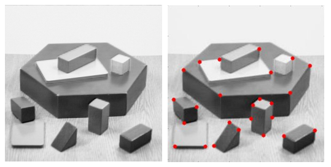

# Algoritmo di Harris

## Definizione

L'algoritmo di Harris rientra nella categoria degli algoritmi di segmentazione delle immagini, con l'obiettivo di individuare i corner.

Si definisce corner un particolare punto corrispondente all'intersezione di due bordi, in altre parole la variazione d'intensità fornita dal gradiente nell'intorno del punto considerato presenta due direzioni distinte e separate.

## Algoritmo

### 1. Calcolo del gradiente delle variazioni d'intensità

Si filtra l'immagine di input applicando i kernel di Sobel sia in direzione orizzontale che verticale.

```c++
Mat dx, dy;
Sobel(src, dx, CV_32F, 1, 0);
Sobel(src, dy, CV_32F, 0, 1);
```

### 2. Calcolo del gradiente quadro e prodotto delle due componenti

```c++
Mat dx2, dy2, dxdy;
pow(dx, 2, dx2);
pow(dy, 2, dy2);
multiply(dx, dy, dxdy);
```

### 3. Applicazione filtro gaussiano alle tre matrici

```c++
GaussianBlur(dx2, dx2, Size(5, 5), 4/6, 4/6);
GaussianBlur(dy2, dy2, Size(5, 5), 4/6, 4/6);
GaussianBlur(dxdy, dxdy, Size(5, 5), 4/6, 4/6);
```

### 4. Calcolo del coefficiente di *cornerness*

La ricerca dei corner avviene mediante il calcolo dei valori di *cornerness* per tutta l'immagine. Essa consiste nel calcolo della seguente equazione.


Dove α è una costante fissata generalmente pari a 0,04 e *M* è una matrice 2x2 dove ogni componente è costituita da un gradiente:


```c++
Mat det, dx2dy2, dxdy2;
multiply(dx2, dy2, dxdy2);
multiply(dxdy, dxdy, det);

Mat trc = dx2 + dy2;
Mat trc2;
pow(trc, 2, trc2);


Mat R = det - 0.04 * trc2;

normalize(R, R, 0, 255, NORM_MINMAX, CV_8U);
```

### 5. Evidenziamento corner trovati

Una volta trovati tutti i potenziali corner, si può fare un'ulteriore scrematura escludendo tutti i valori di pixel inferiori ad una certa soglia minima e tracciare un cerchietto (oppure un punto, quadrato...) su ogni corner rilevato.

```c++
Mat out = src;
cvtColor(src, out, COLOR_GRAY2BGR);
for (int i = 0; i < src.rows; i++)
	for (int j = 0; j < src.cols; j++)
		if (R.at<uchar>(i, j) > 140)
			circle(out, Point(j, i), 6, Scalar(0, 0, 255));
```

## Esempio


